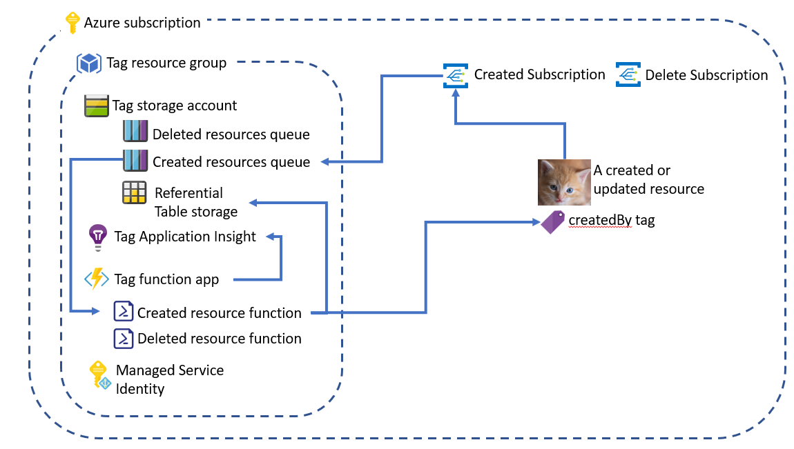
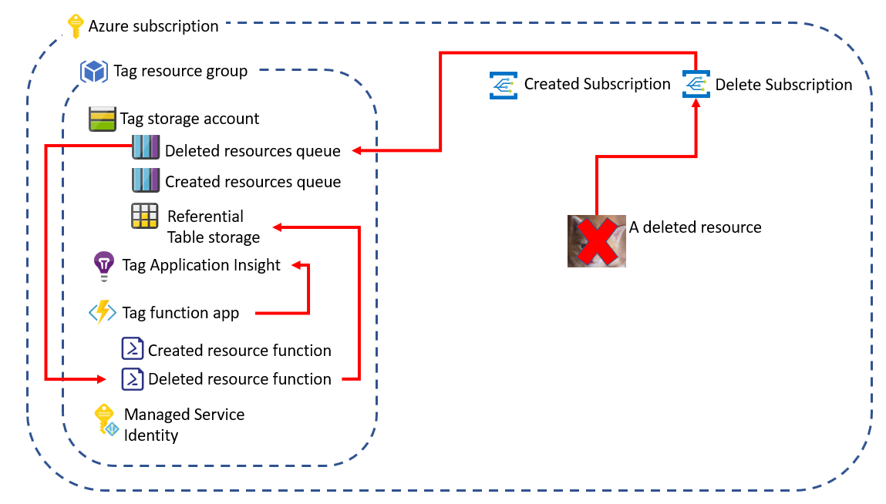

[](https://dev.azure.com/chatoninthecloud/tag-azure-resources/_build/latest?definitionId=3&branchName=master)

[](https://dev.azure.com/chatoninthecloud/tag-azure-resources/_build/latest?definitionId=4&branchName=master)

# azure-tag-created-by
Add a tag on Azure resources with its creator

# Global design

## Resource Creation overview



When a new resource is created inside the Subscription, an Event Grid Subscription (with a filter on event type Resource Write Success) retrieve the event. The Event Grid Subscription backend is an Azure Storage Queue

A PowerShell Azure Function App, with a Storage Queue Trigger binding on this queue, process the message

Using its Managed Service Identity, add a tag "createdBy" to the newly created resource, and update the referential in an Azure Storage Table

And voila, c'est cuit

## Resource Deletion overview



When a resource is deleted inside the Subscription, an Event Grid Subscription (with a filter on event type Resource Delete Success) retrieve the event. The Event Grid Subscription backend is an Azure Storage Queue

A PowerShell Azure Function App, with a Storage Queue Trigger binding on this queue, process the message

Using its Managed Service Identity, remove the resource from the referential

A TABLE

# Requirements
## Tools
To deploy this tool to your Azure Subscription, you need to have installed 

* Terraform

https://www.terraform.io/downloads.html
 
* Azure PowerShell module

https://docs.microsoft.com/bs-latn-ba/powershell/azure/install-az-ps?view=azps-2.5.0

* Azure Function tools
  
https://docs.microsoft.com/fr-fr/azure/azure-functions/functions-run-local

## Service Principal

The service principal used by terraform must be Owner of the Subscription, since it will create
* All the required resources (Contributor required)
  * The resource group
  * The storage account
  * The function app, with its Managed Service Identity
  * The Application Insight
* The role assignment, as a Contributor, of the function app identity (Owner required)

# Deployment

Clone this repository (might really be helpfull)

## Terraform

Update the _dev.tfvars.json_ file inside the _terraform\environment_ folder

```json
{
    "region" : "Region where resources will be created",
    "resourceGroupName" : "Name of the Resource Group where resources will be created",
    "storageAccountName" : "Name of the Resource Group used for queue and Function App",
    "resourceCreatedQueue" : "Name of the queue used as endpoint for the created resources Event Grid Subscription",
    "resourceDeletedQueue" : "Name of the queue used as endpoint for the deleted resources Event Grid Subscription",
    "tableName" : "Name of the Table Storage used for stocking resources creators",
    "resourceCreatedSubscription" : "Name of the Event Grid Subscription for created resources",
    "resourceDeletedSubscription" : "Name of the Event Grid Subscription for deleted resources",
    "appServicePlanName" : "Name of the App Service Plan",
    "functionAppName" : "Name of the Function App",
    "applicationInsightName" : "Name of the Application Insight used to monitor the Function App"
}
```

A default value is present for all resources without public FQDN (The Storage Account and the Function App)

Set the following environment variables, according to your shell (windows here)

```
SET ARM_CLIENT_ID=The service principal application Id
SET ARM_CLIENT_SECRET=A service principal secret key
SET ARM_SUBSCRIPTION_ID=The subscription Id
SET ARM_TENANT_ID=The tenant Id
```

Run the following commands inside the terraform folder
```
terraform init
terraform plan -var-file=.\environment\dev.tfvars.json
```

If the plan seems fine to you
```
terraform apply -var-file=.\environment\dev.tfvars.json
```

## Azure Function

If you changed the name of the queues in terraform var file, don't forget to update the *queuename* in the *function.json* files inside each function in the *function*

Deploy the Azure Function with Azure Function Core Tools

Run the following commands inside the *function* folder
```
Connect-AzAccount
Get-AzSubscription -SubscriptionId "The subscription Id" | Select-AzSubscription
func azure functionapp publish thefunctionappname
```
